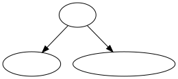

*__DISCLAIMER__: Femiwiki does not service the graphvis-lambda API anymore.*

&nbsp;

graphviz-lambda
========
A simple web service that renders DOT files as svg. Forked from https://github.com/chrisns/graphviz-lambda

```console
$ curl https://pastebin.com/raw/muh0hTaF
digraph {
    A [label="여혐"];
    B [label="여성혐오"];
    C [label="문학계 여혐"];
    C [label="과학계 여혐"];
    A -> {B, C};
}

$ curl 'https://xxxxxxxxxx.execute-api.ap-northeast-2.amazonaws.com/latest/svg?url=https://pastebin.com/raw/muh0hTaF'
```



&nbsp;

Instructions
--------
```sh
# Prepare the AWS credentials

yarn
yarn claudia create --region ap-northeast-2 --api-module app
yarn claudia update

# See https://claudiajs.com/tutorials/hello-world-api-gateway.html for further details
```

&nbsp;

--------
*graphviz-lambda* is primarily distributed under the terms of both the [MIT
license] and the [Apache License (Version 2.0)]. See [COPYRIGHT] for details.

[MIT license]: LICENSE-MIT
[Apache License (Version 2.0)]: LICENSE-APACHE
[COPYRIGHT]: COPYRIGHT
